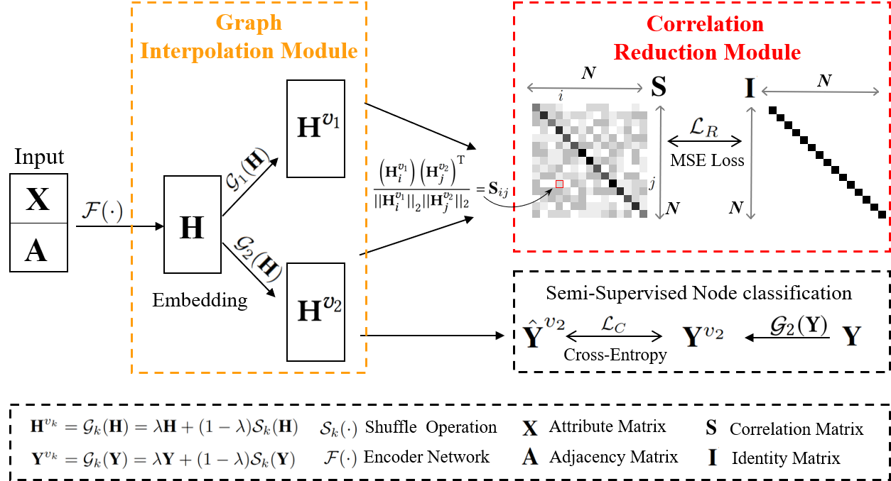

[stars-img]: https://img.shields.io/github/stars/xihongyang1999/MGCN?color=yellow
[stars-url]: https://github.com/xihongyang1999/MGCN/stargazers
[fork-img]: https://img.shields.io/github/forks/xihongyang1999/MGCN?color=lightblue&label=fork
[fork-url]: https://github.com/xihongyang1999/MGCN/network/members
[visitors-img]: https://visitor-badge.glitch.me/badge?page_id=xihongyang.1999.MGCN/
[adgc-url]: https://github.com/xihongyang1999/MGCN

# Mixed Graph Contrastive Network for Semi-Supervised Node Classification

<p align="center">   
    <a href="https://pytorch.org/" alt="PyTorch">
      </a>
<p/>


[![GitHub stars][stars-img]][stars-url]
[![GitHub forks][fork-img]][fork-url]
[![visitors][visitors-img]][adgc-url]


An official source code for paper Mixed Graph Contrastive Network for Semi-Supervised Node Classification.  Any communications or issues are welcomed. Please contact xihong_edu@163.com. If you find this repository useful to your research or work, it is really appreciate to star this repository. :heart:

-------------

### Overview

<p align = "justify"> 
 Illustration of Mixed Graph Contrastive Network for Semi-Supervised Node Classification (MGCN) mechanism. 
</p>
<div  align="center">    
    
</div>


### Requirements

The proposed MGCN is implemented with python 3.8.8 on a NVIDIA 1080 Ti GPU. 

Python package information is summarized in **requirements.txt**:

- torch==1.8.0
- tqdm==4.61.2
- numpy==1.21.0
- tensorboard==2.8.0


### Quick Start

```
python train.py 
```


### Citation

If you use code or datasets in this repository for your research, please cite our paper.

```
@article{MGCN,
  title={Mixed graph contrastive network for semi-supervised node classification},
  author={Yang, Xihong and Wang, Yiqi and Liu, Yue and Wen, Yi and Meng, Lingyuan and Zhou, Sihang and Liu, Xinwang and Zhu, En},
  journal={ACM Transactions on Knowledge Discovery from Data},
  volume={18},
  number={7},
  pages={1--19},
  year={2024},
  publisher={ACM New York, NY}
}

```

